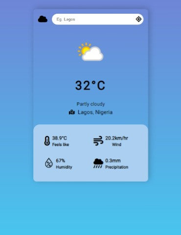

# Weather App

### Screenshot

### Links

-  Live Site URL: [https://weather-app-j.web.app/](https://weather-app-j.web.app/)

### Built with

-  Semantic HTML5 markup
-  Flexbox
-  [React](https://reactjs.org/) - JS library
-  [Weather API](https://www.weatherapi.com/) - API for the weather info

## Author

-  Frontend Mentor - [@johnsiner](https://www.frontendmentor.io/profile/johnsiner)
-  Twitter - [@iam_johnsin](https://www.twitter.com/iam_johnsin)
